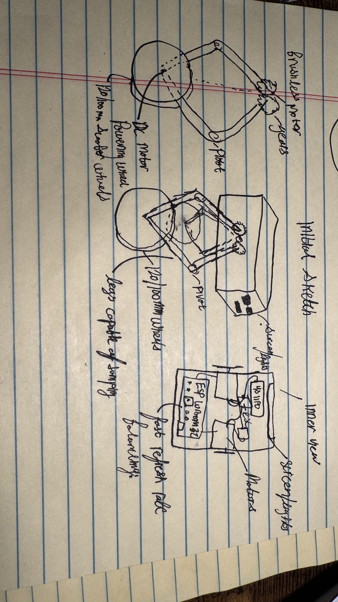

## 6/11/25 - Initial Sketches and First CAD Design

We started by drawing an initial sketch of the robot's design. It has a motor and gear on each side which allow it to quickly move the wheels up to jump. Additionally, each side is independent so it can go up a hill and have uneven height on each side. We are planning to use an ESP-Wroom-32 as a fast microcontroller so the robot can stay balanced. We are planning to use PID or LQR to balance the robot.

### Initial CAD Design

