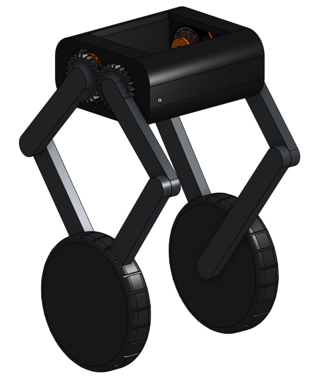
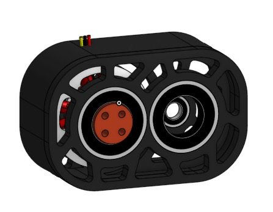
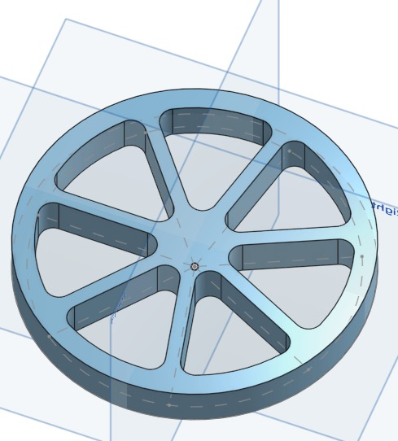
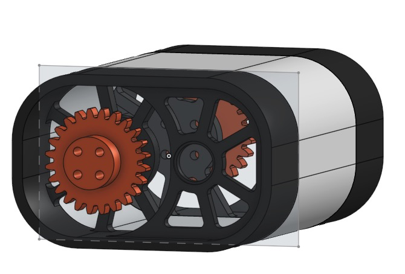
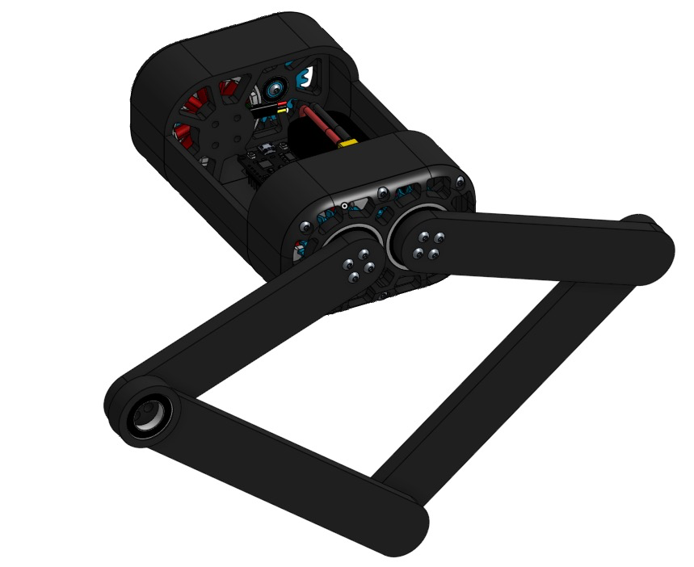
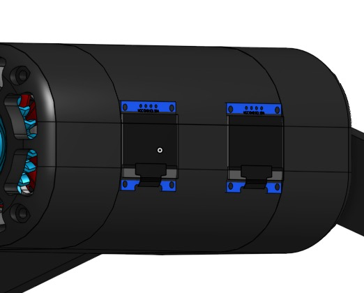
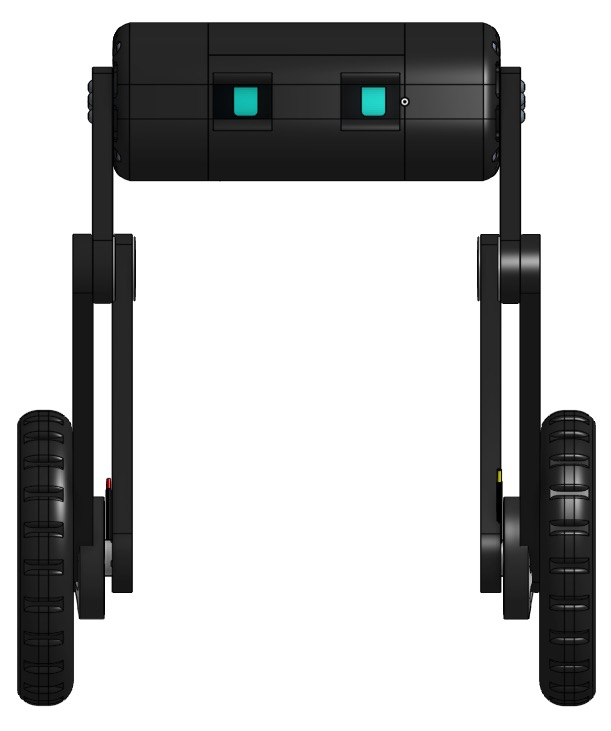
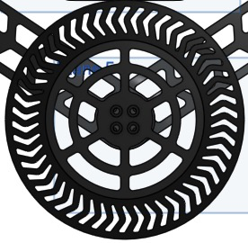
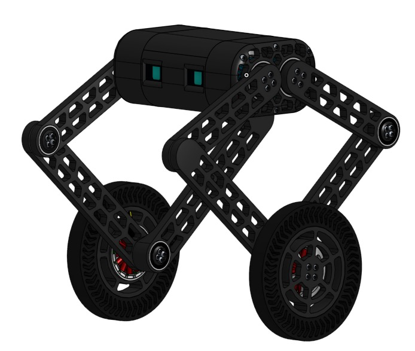
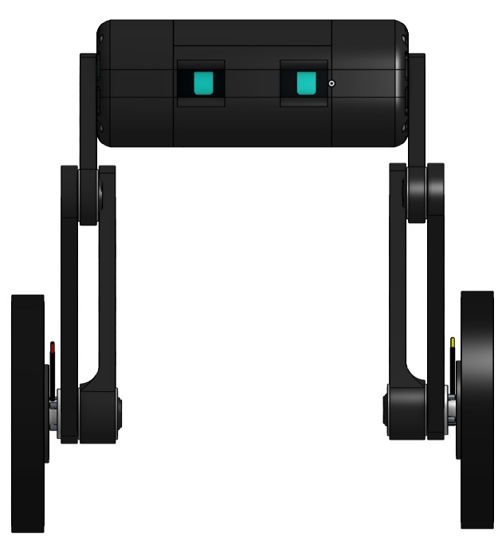

*Note for all time spent, it is counting for 1 person working on the bot, we both worked only worked on it together so the total time is listed here is half the amount for both of us*

## Total Time Spent: 13 Hours

## 6/11/25 - Initial Sketches and First CAD Design

### Time Spent: 2.5 Hours

We started by drawing an initial sketch of the robot's design. It has a motor and gear on each side which allow it to quickly move the wheels up to jump. Additionally, each side is independent so it can go up a hill and have uneven height on each side. We are planning to use an ESP-Wroom-32 as a fast microcontroller so the robot can stay balanced. We are planning to use PID or LQR to balance the robot.

Initial CAD Design of the robot

## 6/12/25 - New CAD Design

### Time Spent: 3.5 Hours

We changed the CAD design to have a mount for the motor and also have the arms be properly mounted with a bearing. Additionally, we changed the style for the motor, now it has a 2 gear design that will ensure the wheels mainly stay centered under the bot.

View of motor without legs attached. Two bearings will help smoothly rotate each leg

Basic wheel which we will wrap rubber to give better traction.

Joined halfs with empty space for battery, esc and microcontroller.

## 6/13/25 - CAD Design Nearly Finished

### Time Spent: 5 Hours

While designing the model we started to test some old parts we had laying around to see if our IMU would work as fast enough to balance the robot. We used a servo as motor to see kindof what the code would look like, however, in our actual bot we would be using a brushless motor.

Picture of the robot with the motors and mounting fully done. We just need to add some mounting for the internal protoboard and fix the legs with proper bearings.

These screens will be used as eyes and will ideally have a animation to might even be dependent on the speed of the robot. We are planning to use the ESP32 to control them.

The front view of the robot shows its design and how the wheels are mounted and an example face of the robot.

The only thing that needs to be improved is the legs and their mounting to the wheels.

## 6/14/25

### Time Spent: 2 Hours

Finished the CAD including making the leg joints work with a bearing and mounting the wheels onto the legs.

The finished wheel design with a TPU tire to give it more traction. The wheel and leg are both designed to be very light so that the robot can quickly move its legs up and down without using an overly powerful motor.

The finished robot design

Front view of the robot
