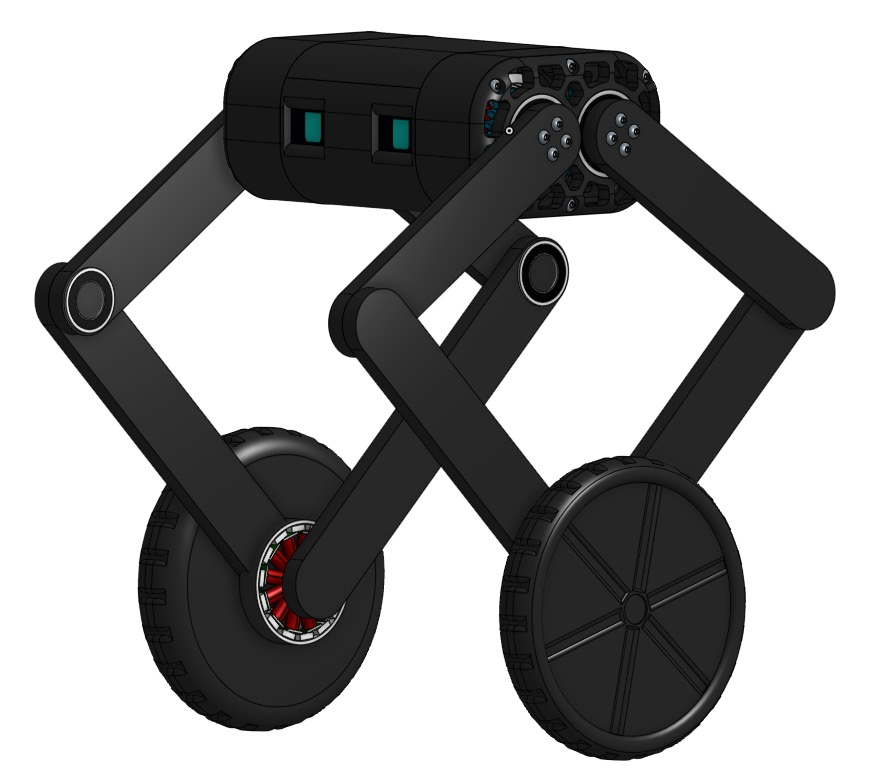
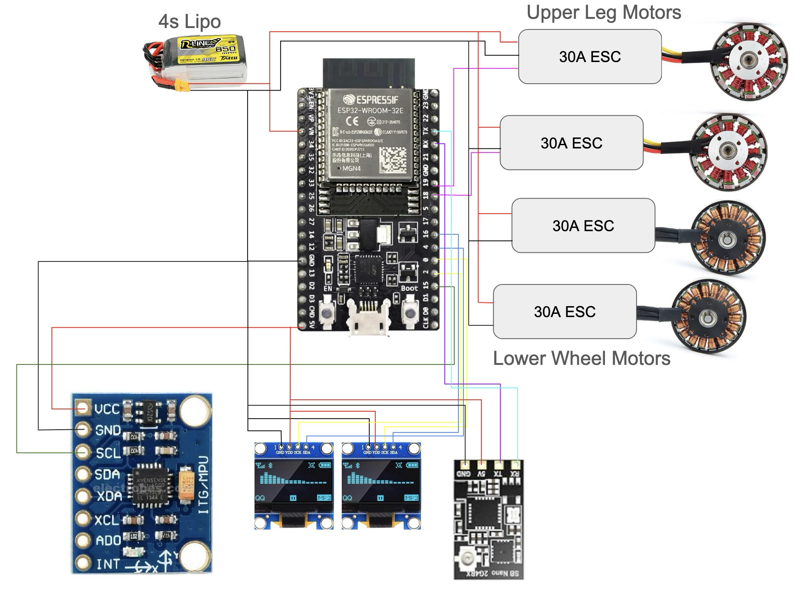

# Wall-V

Wall-V is a 2 legged, self-balancing robot that has wheels and can jump. It is designed to be able to go up hills and have uneven height on each side. The robot uses an ESP-Wroom-32 as a fast microcontroller to stay balanced. We are planning to use either PID to maintain balance.

## Why we are building this

We are building Wall-V to experiment with self-balacing robots that have the capability to jump. Jumping will allow to robot to go over small obstacles and be more manuverable and it will have to have high torque motors to align the robot.

## Wiring Diagram

## Parts List

<table class="table table-bordered table-hover table-condensed">
<thead><tr><th title="Field #1">Quantity</th>
<th title="Field #2">Name</th>
<th title="Field #3">Notes</th>
<th title="Field #4">Price</th>
</tr></thead>
<tbody><tr>
<td align="right">2</td>
<td>VGEBY Brushless Motor 1PCS 5010 360KV</td>
<td>These two motors power the arms and have high torque that can quickly pull up the legs enabling the robot to jump</td>
<td align="right">27.62</td>
</tr>
<tr>
<td align="right">1</td>
<td>HiLetgo 3pcs GY-521 MPU-6050 MPU6050</td>
<td>This pack comes with 3 gyroscopes for value</td>
<td align="right">10.99</td>
</tr>
<tr>
<td align="right">1</td>
<td>ESP32-DevKitC-32E Development Board</td>
<td>This is the main microcontroller for the robot which has a very fast tick rate for self-balancing</td>
<td align="right">11</td>
</tr>
<tr>
<td align="right">1</td>
<td>5pcs CJMCU-103 Rotary Angle Sensor Module SMD SV01A103AEA01R00 Trimmer 10K Potentiometer Analog Voltage Output</td>
<td>A set of 5 rotary encoders to tell the angle which the robots legs and wheels are at enabling it to jump and stay balanced better</td>
<td align="right">11.99</td>
</tr>
<tr>
<td align="right">1</td>
<td>30A Electric Brushless Motor Controller 2 Pcs ESC Speed Controller with XT60 and 3.5mm Bullet Plugs</td>
<td>2 ESCs that control the leg motors</td>
<td align="right">17.59</td>
</tr>
<tr>
<td align="right">1</td>
<td>MF148ZZ Flanged Ball Bearing ID 8mm x OD 14mm x Width 4mm</td>
<td>10 flanged bearings to enable the legs to pivot smoothly</td>
<td align="right">8.99</td>
</tr>
<tr>
<td align="right">1</td>
<td>SpeedyBee ELRS FPV Receiver - 2.4ghz ExpressLRS Nano Receiver Drone RX Module with 78mm UFL T Antenna</td>
<td>ELRS receiver to control the robot with a remote</td>
<td align="right">14.99</td>
</tr>
<tr>
<td align="right">1</td>
<td>0.96 Inch OLED Display Module 12864 LCD Screen 128x64 IIC I2C OLED Board SSD1315</td>
<td>2 small OLED screens that will serve as the robots eyes</td>
<td align="right">9.99</td>
</tr>
</tbody></table>